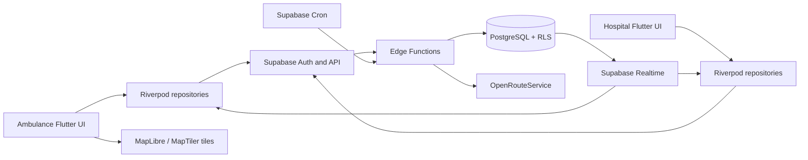
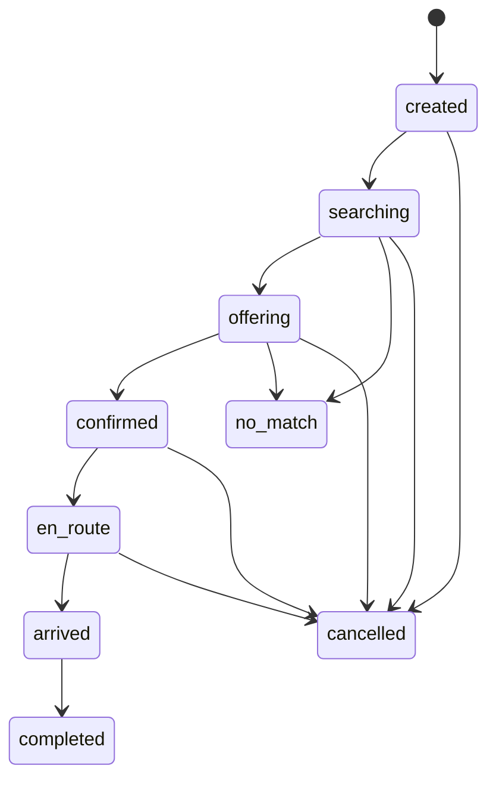
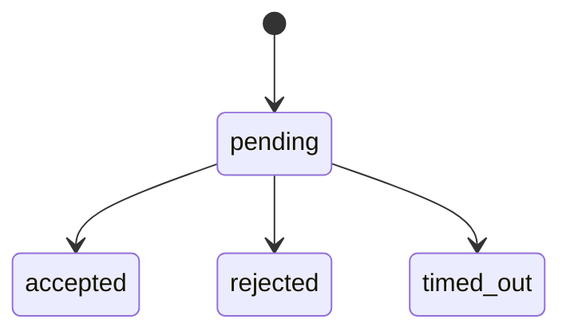
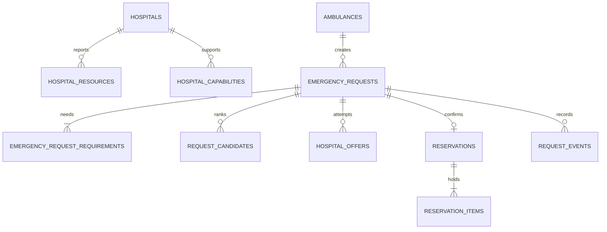

# BedLink Technical Architecture

Status: proposed implementation contract for the Mumbai MVP. Product behavior lives in `PRD.md`; coding constraints live in `rules.md`. Database names and lifecycle values in this document are canonical for implementation.

## 1. Architecture overview

One Flutter application presents hospital and ambulance experiences after role resolution. Supabase Auth establishes identity. PostgreSQL is the source of truth. Edge Functions handle authenticated API orchestration and external routing calls. Transactional PostgreSQL functions own state transitions and inventory accounting. Supabase Realtime delivers connected-state hints; clients always reconcile from the database after reconnect. No long-running Edge Function waits for a two-minute offer.

## 2. Technology stack

| Layer | Choice | Purpose |
|---|---|---|
| UI | Flutter/Dart | Android-first shared app |
| State | Riverpod | Async state and dependency wiring |
| Backend | Supabase Edge Functions | Input validation, routing proxy, workflow entry points |
| Source of truth | Supabase PostgreSQL | Relational data, transactions, constraints, RLS |
| Identity | Supabase Auth | Sessions and user identity |
| Connected updates | Supabase Realtime | Authorized change notifications |
| Expiry worker | Supabase Cron/`pg_cron` | Periodic server-side timeout/recovery sweep |
| GPS | `geolocator` | Ambulance position |
| Map | `maplibre_gl` + MapTiler | Tile display and route overlay |
| Road routing | OpenRouteService Matrix/Directions | ETA and post-accept route |
| Local pointer storage | `shared_preferences` | Non-sensitive active request recovery |
| Version control | GitHub | Review and history |

## 3. Why each technology is used

Flutter gives one codebase for both roles. Riverpod keeps business state outside widgets. Supabase covers identity, database, RLS, Realtime, and Edge Functions with little hackathon infrastructure. PostgreSQL functions provide atomic multi-row transitions that a series of client calls cannot. Cron makes expiration independent of either device. Matrix compares roads for several destinations; Directions supplies geometry after acceptance. MapLibre renders the route and MapTiler supplies tiles. Shared preferences stores only recovery pointers.

## 4. High-level architecture diagram



## 5. Client architecture

Feature-first modules expose screens, Riverpod providers, domain models, repositories, and mappers. Widgets render provider state and dispatch intent. Repositories call Supabase reads or Edge Functions; no widget performs ranking, inventory math, fallback, or reservation creation. A request detail repository can fetch a single authoritative snapshot (request, current offer, candidate summary, reservation/items, hospital). Local persistence stores only request/ambulance IDs and last displayed status. The authenticated snapshot overrides cached state after every resume/reconnect.

## 6. Backend architecture

Edge Functions: `create-emergency-request`, `find-and-offer`, `respond-to-offer`, `cancel-request`, `confirm-arrival`, `update-hospital-resource`, `confirm-hospital-availability`, `get-request-snapshot`, `get-route`, and `recover-workflows`. Exact function names may be adjusted together before coding. Each verifies the JWT, role association, payload, and idempotency key where needed. Critical transitions call narrowly granted PostgreSQL functions in one transaction. A server-only recovery sweep is invoked by Cron; it processes expired offers and stranded work in bounded batches. Edge Functions must not use multiple independent database calls as a substitute for one transaction.

## 7. Database architecture

Use normalized tables for identities, directory, capability, resource inventory, requirements, ranked candidates, offers, reservations, items, and events. UUID primary keys are internal. Ten-digit numeric IDs are unique display identifiers, stored as `char(10)` with a digit check. All timestamps are `timestamptz` in UTC. `resource_type` and state columns use constrained text or PostgreSQL enums consistently in migrations; prefer constrained text for hackathon migration ease.

## 8. Authentication architecture

Supabase Auth `auth.users.id` is the authenticated UUID. `profiles.user_id` references it and carries one immutable role plus either `hospital_id` or `ambulance_id`. Auth credentials may use an internal email/phone login while a 10-digit ID is shown to users. Demo provisioning creates distinct strong passwords; ID=password is forbidden outside a deliberately isolated demonstration and still discouraged. On every privileged call, derive role and organization from the verified user, never from a client-supplied role.

## 9. Role-based access

Hospital staff reads and edits only their hospital's resource reports and own offers/holds. Ambulance crew reads and acts only on their ambulance's request; before confirmation, a restricted candidate projection exposes public hospital directory, compatible resource counts, ETA, and freshness but no other crew data. Admin setup uses controlled server credentials, not a shipped admin screen. After confirmation, the hospital and ambulance may read the shared request summary needed for handoff.

## 10. Supabase RLS strategy

Enable RLS on every public table, default deny, and grant explicit `SELECT` policies by profile association. Direct client `INSERT/UPDATE/DELETE` is denied for `hospital_offers`, `reservations`, `reservation_items`, `request_events`, inventory counters, and request lifecycle fields. Restricted `SECURITY DEFINER` functions in a non-exposed schema or service-role-backed Edge Functions perform transitions after identity checks; set an empty `search_path` with schema-qualified objects, revoke public execution, and grant only required roles. Prefer invoker functions when elevated privilege is unnecessary. Service-role credentials never reach Flutter. Test cross-hospital and cross-ambulance access, including Realtime visibility. Directory-only projections can have broader authenticated read policies.

## 11. Realtime architecture

MVP may use authorized Postgres Changes on a small number of request/offer/reservation tables. Realtime events are invalidation signals; the client fetches the request snapshot rather than trusting event order or payload. Hospital subscribes to its offers; ambulance to its own request. Set publication membership and RLS deliberately. For scale, move to private Broadcast channels with authorization policies. On subscription, immediately fetch a snapshot to close the subscribe/fetch race; refetch on reconnect, app resume, and role/session change.

## 12. Offline/reconnection architecture

Only acknowledged requests are treated as active. The client persists `active_request_id`, last known state, and reservation ID via `shared_preferences`. Offline UI marks cached data “Last confirmed at …” and disables accept, cancel, arrival, and new submission until a server response is obtained. Creation uses a client-generated idempotency UUID; a retry first resolves the existing request. On reconnect, refresh Auth, fetch the snapshot, apply its monotonic `version`, then resubscribe/refetch. If a local pointer is missing, query the server for the user's active request.

## 13. Edge Function architecture

`create-emergency-request` validates coordinates/requirements and creates a request idempotently. `find-and-offer` searches, calls Matrix, ranks, stores candidates, and opens first offer via a transaction. `respond-to-offer` delegates accept/reject to a transactional RPC. `recover-workflows` is a scheduled sweep that expires offers, advances next candidates, and resumes a stranded request. `get-route` proxies Directions after confirmation. Resource update and confirm functions validate hospital assignment. Functions return typed error codes (`AUTH_REQUIRED`, `NO_LOCATION`, `ROUTING_UNAVAILABLE`, `OFFER_EXPIRED`, `CAPACITY_LOST`, etc.) and a request ID for log correlation.

## 14. OpenRouteService integration

The Edge Function holds the ORS API key. For shortlist candidates it calls Matrix with one ambulance source and multiple hospital destinations; coordinates are `[longitude, latitude]`. Reject null/unreachable durations. Do not substitute straight-line travel time as road ETA. Cache only briefly by rounded coordinate pair if needed; do not reuse stale ETA as live. `get-route` uses Directions for the accepted hospital and returns geometry, duration seconds, and distance meters. Enforce timeout, bounded retries, quota handling, and an explicit unavailable state.

## 15. MapLibre + MapTiler integration

The Flutter map uses `maplibre_gl` and a MapTiler style/tiles configuration. A MapTiler key intended for client map rendering is restricted by provider controls where supported; it is not treated like a server secret. The ORS key remains server-only. Show accepted hospital marker, ambulance marker, route polyline, textual ETA and distance. If tile loading fails, preserve text destination and route summary.

## 16. Hospital discovery algorithm

1. Validate server-side coordinates and request requirements, including at least one countable resource so an accepted request has an actual hold item.
2. Query active hospitals by geographic bounding box/coarse great-circle distance for configurable radii `[5,10,15,20,30]` km, stopping after at least five compatible candidates or the maximum. For Mumbai MVP, a latitude/longitude bounding query plus precise distance check is adequate; PostGIS is optional later.
3. Hard-filter enabled capabilities, positive effective availability for every countable requirement, and required-resource age under the offer ceiling (default 30 minutes). Unknown counts fail.
4. Cap shortlist (default 20) before Matrix. If no compatible candidates remain, set `no_match` with cause. Persist the radius and filter explanation for diagnostics.
5. Matrix may mark a road destination unreachable; exclude it. Routing failure yields `routing_unavailable` and a retryable request state, not a fake ETA.

## 17. Hospital ranking algorithm

For each compatible candidate compute normalized values in `[0,1]`: clinical margin/optional matches, inverse ETA, freshness, spare capacity, and inverse load. Score = `0.40*C + 0.25*E + 0.15*F + 0.10*A + 0.10*L`. Mandatory match is a prerequisite, so clinical score never forgives an unmet requirement. Define normalization bounds in one server config file, not UI code. Load uses reported occupied/operational capacity when complete; otherwise display unknown and use conservative neutral score. Stable sort by score descending, ETA ascending, freshness age ascending, hospital ID. Persist candidate score components and algorithm version. The score is deterministic operational support, not clinical AI.

## 18. Emergency workflow



The ambulance submits once; server persists state and candidate order. A confirmed reservation may exist only in `confirmed`, `en_route`, or `arrived`/`completed` lifecycle. `no_match` is terminal for that request; retry creates a new request with a new idempotency key.

## 19. Offer workflow



Exactly one pending offer per request, enforced by a partial unique index. The current offer references a persisted ranked candidate. Accept checks actor hospital, deadline, request state, and inventory in one transaction. Reject settles and advances. Candidate sequence is immutable for a request unless an explicit server retry reranks under a new request.

## 20. Timeout handling

Server sets `created_at` and `expires_at` 120 seconds apart. The acceptance RPC compares `clock_timestamp()` with `expires_at` under lock; a late click never wins because the client clock differs. Supabase Cron invokes recovery at a 10-second demo interval if supported by the configured project; if only minute granularity is available, use that and document the observed delay. Exact deadline still governs acceptance. Sweep marks expired offers and advances in bounded batches. It is idempotent and safe under overlapping runs.

## 21. Automatic fallback

Advance uses a transaction that locks the request, verifies no accepted reservation, settles current offer if needed, selects the next unoffered candidate by rank, and inserts one pending offer; if none remain it writes `no_match` with cause. Immediate rejection invokes advance; recovery sweep handles timeout and crashed invocations. A capacity race during acceptance settles that offer as rejected with reason `capacity_lost` and advances. Persist events for all transitions. A process crash between database commit and client response cannot duplicate offers because of unique constraints and idempotency checks.

## 22. Reservation architecture

`reservations` is one row per accepted request; `reservation_items` records each held countable resource and quantity. A request must contain at least one countable resource; capability requirements are verified but have no inventory hold row. Reserving ICU + ventilator therefore locks and decrements both counts, or neither. Hold state: `accepted -> en_route -> arrived -> completed`; `accepted/en_route -> cancelled -> released` as one release operation represented by final `released` state with cancellation event. Request and reservation states move together transactionally. No automatic expiry of accepted holds during the MVP.

## 23. Transaction and race handling

Acceptance locks request and offer, then inventory rows in stable resource-code order (`SELECT ... FOR UPDATE`). It verifies every `available_count >= quantity`, updates `available_count -= quantity`, `held_count += quantity`, inserts reservation/items, settles offer, and updates request in one transaction. A unique `reservations.request_id` prevents duplicate holds. A partial unique index prevents two pending offers. Release locks the same rows, changes each quantity once, marks reservation released, and records an event. Arrival moves `held_count` to `occupied_count` once. Constraint checks reject negative counters and impossible totals. Every RPC returns current state for idempotent repeats.

## 24. Data freshness model

`hospital_resources.last_confirmed_at` is updated on successful count changes or hospital “confirm no change.” `hospitals.directory_updated_at` is separate and never used as availability age. Relevant listing age is the oldest required resource timestamp. Buckets: `<5` fresh, `<15` recent, `<30` aging, `>=30` stale minutes. Unknown timestamps are unknown/unofferable. A 30-minute maximum offer age is configurable. Client calculates display age from server timestamps, refreshing the label over time without modifying stored data.

## 25. State machines

Canonical values: request `created`, `searching`, `offering`, `confirmed`, `en_route`, `arrived`, `completed`, `no_match`, `cancelled`; offer `pending`, `accepted`, `rejected`, `timed_out`; reservation `accepted`, `en_route`, `arrived`, `completed`, `released`. `pending` is an offer state, not a reservation state. Reject illegal transitions at the database RPC. Increment request `version` on every state change so clients can ignore regressions.

## 26. Error recovery

GPS denial/unavailability: no request until valid coordinates, with explicit manual demo entry. ORS failure: request remains retryable in `searching` with error code; no offers without real road ETA. Supabase outage: show cached state as unverified and retry. Realtime loss: snapshot fetch after reconnect. Timeout worker failure: next sweep and monitoring catch expired rows. Invalid role/auth: deny. No candidates/all rejected/all timed out: `no_match` with specific reason. Capacity loss: atomic rollback of hold and next offer. Cancellation: idempotent release. Every error path must avoid an ambiguous “accepted” display without a committed reservation.

## 27. Security

Verify Supabase JWT on every Edge Function; do not trust request body identity. RLS protects direct reads. Privileged DB functions validate associations independently. Least-privilege secrets in Supabase environment/Vault; rotate demo credentials before any broader access. Validate coordinate bounds, count limits, resource codes, status, and payload size. Rate-limit create/response functions. Use HTTPS and minimize patient information. Do not expose service-role or ORS secrets in Flutter, logs, or repository.

## 28. Environment variables and secrets

Flutter receives Supabase project URL, publishable/anon key, and a constrained MapTiler client key through build configuration; these are public identifiers, not authorization secrets. Edge Functions receive ORS key and any service-role credential from Supabase-managed secrets. Cron credentials stay in Vault if invoking an Edge Function. Provide `.env.example` later with names only; never commit values.

## 29. Logging

`request_events` stores actor, request ID, old/new state, reason code, and timestamp for audit/debug. Edge logs include correlation ID, function, duration, ORS status class, and sanitized error code. Do not log patient details, full JWTs, passwords, service keys, or precise location by default. Monitor pending offers past deadline, negative-count constraint failures, routing error rate, and rejected authorization.

## 30. Proposed PostgreSQL schema

| Table | Important columns and constraints |
|---|---|
| `profiles` | `user_id uuid PK -> auth.users`, `role`, `hospital_id?`, `ambulance_id?`, `display_id char(10) UNIQUE`, timestamps; exactly one association for operational roles |
| `hospitals` | `id uuid PK`, `display_id char(10) UNIQUE`, `name`, `address`, `latitude`, `longitude`, `is_active`, `directory_updated_at`, source attribution |
| `hospital_capabilities` | `(hospital_id, capability_code) PK`, `enabled`, `updated_at`; codes `cardiac_care`, `trauma_care`, `burns_care`, `pediatric_icu_care` |
| `hospital_resources` | `(hospital_id, resource_code) PK`, `total_capacity`, `available_count`, `held_count`, `occupied_count`, `unavailable_count`, `last_confirmed_at`, `version`; six countable codes; nonnegative, `sum <= total_capacity` where reported counts are complete |
| `ambulances` | `id uuid PK`, `display_id char(10) UNIQUE`, `label`, `is_active` |
| `emergency_requests` | `id uuid PK`, `ambulance_id`, `created_by`, `idempotency_key uuid UNIQUE per ambulance`, `latitude`, `longitude`, `urgency`, `status`, `failure_reason?`, `version`, timestamps |
| `emergency_request_requirements` | `(request_id, requirement_code) PK`, `quantity > 0`, `kind` (`resource`/`capability`); canonical code catalog enforced |
| `request_candidates` | `(request_id, hospital_id) PK`, `rank UNIQUE per request`, `radius_km`, `eta_seconds`, `score`, component JSON/columns, `algorithm_version`, `created_at` |
| `hospital_offers` | `id uuid PK`, `request_id`, `hospital_id`, `candidate_rank`, `status`, `created_at`, `expires_at`, `responded_at?`, `reason_code?`; one pending per request |
| `reservations` | `id uuid PK`, `request_id UNIQUE`, `hospital_id`, `status`, `accepted_at`, `arrived_at?`, `released_at?`, `version` |
| `reservation_items` | `(reservation_id, resource_code) PK`, `quantity > 0`, FK to hospital resource through reservation hospital validated by RPC/trigger |
| `request_events` | `id bigint PK`, `request_id`, `actor_user_id?`, `event_type`, `from_status?`, `to_status?`, `reason_code?`, `created_at` |

`available_count` is effective free capacity and is decremented by a hold. `held_count` is active holds. Staff quick updates change `available_count` and clear previously reported `occupied_count` and `unavailable_count` to unknown; the UI then shows “Load unavailable.” An advanced reconciliation explicitly records those counts and total capacity. A trigger/RPC validates `available + held + occupied + unavailable <= total_capacity` when all counts are known; constraints always enforce `available + held <= total_capacity`. Do not silently infer occupied from a quick `+/-` tap. Dynamic demo values are seeded as explicitly simulated.

## 31. Relationships



## 32. Indexing strategy

Unique display IDs and `(hospital_id, resource_code)` support identity/inventory. Partial unique `hospital_offers(request_id) WHERE status='pending'`; unique `reservations(request_id)`; unique `(request_id, rank)`; `(status, expires_at)` for timeout scan; `(ambulance_id, status)` for active request recovery; `(hospital_id, status)` for hospital inbox; `(request_id, created_at)` for events. A bounding-box index on latitude/longitude is sufficient for seeded Mumbai data; review query plans before adding PostGIS. Add one-active-request-per-ambulance protection in transaction or partial index over active statuses.

## 33. Suggested Flutter folder structure

```text
lib/
  app/                 # app bootstrap, router, theme
  core/                # Supabase client, errors, config, connectivity, local pointers
  shared/              # reusable controls, status chips, models
  features/
    auth/              # login, session, role resolution
    hospital_directory/# public hospital models/detail
    hospital_resources/# counters, freshness, confirmation
    hospital_offers/   # inbox, accept/reject, holds
    ambulance_request/# requirements, creation, status, fallback
    discovery/         # ranked candidate display
    navigation/        # Directions route, map, arrival
```

Each feature uses `presentation/`, `application/` (Riverpod controllers), `domain/`, and `data/` only where warranted; avoid empty scaffolding. Repositories own API calls and mapping. Widgets never directly instantiate Supabase clients.

## 34. Suggested Supabase folder structure

```text
supabase/
  migrations/          # schema, RLS, indexes, transaction functions, cron
  functions/
    _shared/           # auth, errors, config, ORS client
    create-emergency-request/
    find-and-offer/
    respond-to-offer/
    recover-workflows/
    update-hospital-resource/
    confirm-hospital-availability/
    get-request-snapshot/
    get-route/
    cancel-request/
    confirm-arrival/
  tests/               # SQL/RLS and function integration tests
  seed.sql             # explicitly simulated demo availability
```

## 35. Important files and responsibilities

Future `lib/core/config/app_config.dart` reads public build config; `lib/core/data/supabase_provider.dart` owns the client; feature repositories encapsulate queries; `lib/app/router.dart` guards role routes; `supabase/migrations/*` is the only schema history; `_shared/ors_client.ts` owns API key/rate/error handling; transaction SQL owns transitions; `supabase/tests/*` proves RLS and race behavior. These are planned paths, not files created by this documentation task.

## 36. Data flow examples

**Create and offer:** UI submits requirements/location/idempotency key -> Edge validates Auth -> PostgreSQL creates request -> discovery query -> ORS Matrix -> Edge ranks/persists candidates -> DB opens first offer -> Realtime invalidates hospital inbox -> hospital fetches offer.

**Accept:** Hospital sends offer ID -> Edge verifies staff -> DB transaction locks request/offer/inventory, checks deadline/capacity, creates reservation/items and updates counts/status -> Realtime invalidates ambulance status -> ambulance fetches snapshot -> Directions requested and drawn.

**Offline:** Ambulance stores acknowledged request ID -> disconnects -> server rejects/times out/advances/accepts -> client reconnects, refreshes Auth, fetches snapshot, then subscribes and refetches -> displays confirmed state.

## 37. Scalability considerations

Bound Matrix destinations and sweep batch size. Index deadline scans. Keep event retention finite. Move Realtime from Postgres Changes to private Broadcast if volume grows. Add PostGIS when data/radius searches outgrow a small indexed city directory. Monitor ORS quota and route latency. Separate queue infrastructure only when measured load warrants it.

## 38. MVP vs future architecture

MVP is one Supabase project, one Flutter app, deterministic ranking, seeded static hospital directory, BedLink-managed simulated live counts, and periodic timeout sweep. Future work may add verified hospital feeds, push notifications, PostGIS, richer operational monitoring, and regional deployments. No microservices or extra backend framework are required.

## Reference documentation checked

- [Supabase Cron](https://supabase.com/docs/guides/cron) and [scheduled Edge Functions](https://supabase.com/docs/guides/functions/schedule-functions)
- [Supabase Realtime database changes](https://supabase.com/docs/guides/realtime/subscribing-to-database-changes) and [authorization](https://supabase.com/docs/guides/realtime/authorization)
- [Supabase database functions](https://supabase.com/docs/guides/database/functions) and [RLS](https://supabase.com/docs/guides/database/postgres/row-level-security)
- [OpenRouteService Matrix endpoint](https://giscience.github.io/openrouteservice/api-reference/endpoints/matrix/)
- [OpenRouteService Directions response](https://giscience.github.io/openrouteservice/v9.10.0/api-reference/endpoints/directions/requests-and-return-types)
